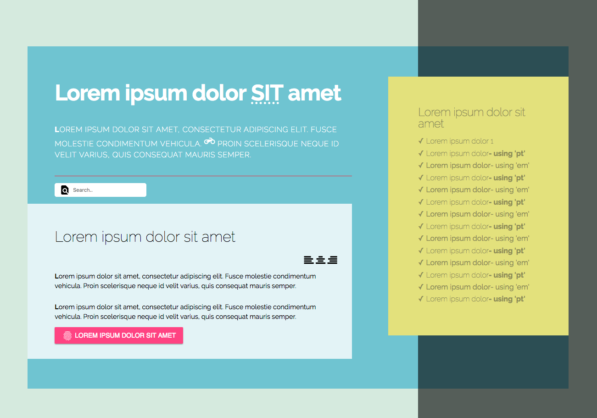

# 009 Fonts, Icons and Sizes

### Before 
You should read about Font Size Documentation here [Kyle Schaeffer][1], about Font Size Properties here [CSS Tricks][2], about Fluid Typography here [CSS Tricks][3] and about Using @font-face here [CSS Tricks][4].

### To Do

Continue the Z Index, !important and Inheritance exercice in which we are going to change some labels using Fonts, Icons and Sizes.

1. Change the Inheritance font for raleway thin with, verdana, arial, sans-serif.
2. The first letter in all the simple text should be bold.
3. Remove the second test at the blue container and create an input with a find in page icon ([Material][6]).
4. Add 3 icons to the right between the title and the first text ([Font Awesome][5]).
4. Remove the third test at the white container and create a button with fingerprint icon ([Material][6]).
5. On the yellow container the pair items should use ‘pt’ and have a text after saying “using ‘pt’ “ 
6. On the yellow container the odd items except the first one should be raleway normal, use ‘em’ and have a text after saying “using ‘em’ ”.
 

### Evaluation Criteria

1. Make it Readable.
2. Good Practices.
3. Use HTML5.
4. Structure Naming Convention.
5. Responsive skills screens from 320px to 1440px.
6. Use correct Cascade code.
7. Use correct Inheritance.
 
 [1]: http://kyleschaeffer.com/development/css-font-size-em-vs-px-vs-pt-vs/
 [2]: https://css-tricks.com/almanac/properties/f/font-size/
 [3]: https://css-tricks.com/snippets/css/fluid-typography/
 [4]: https://css-tricks.com/snippets/css/using-font-face/
 [5]: http://fontawesome.io/icons/
 [6]: https://material.io/icons/
