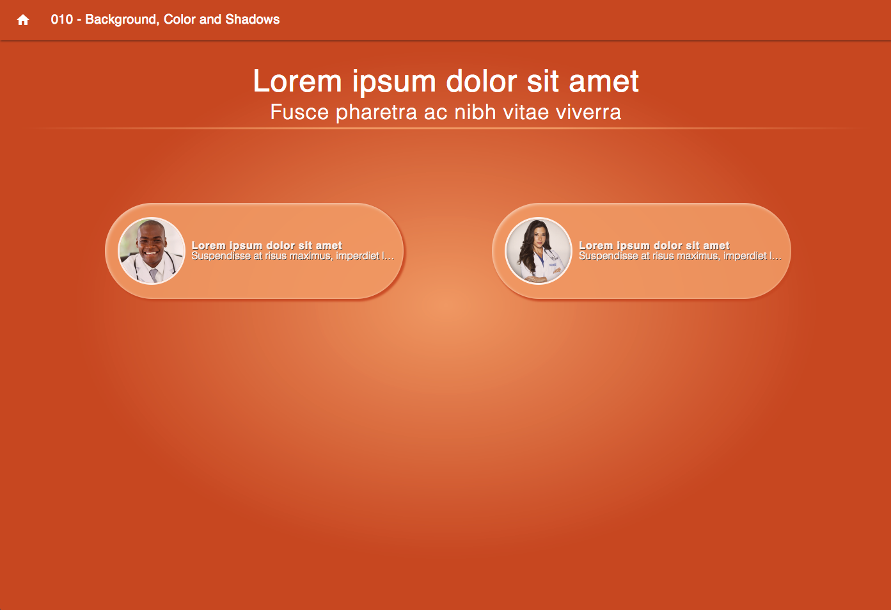

# 010 - Background, Color and Shadows

### Before 
You should read about Background Documentation here [CSS Tricks][1], about Background Image Properties here [CSS Tricks][2], about Shadows Documentatio here [W3 School][3], about Using Box Shadow here [CSS Tricks][4] and about Using Text Shadow here [CSS Tricks][5].

### To Do

Create a the following view with this colors #D24F2E and #f5a275:

1. Create a radial gradient to change the background using rgba.
2. Create a header using text shadows and below create a linear gradient using hexa.
3. Create 2 boxes with left top inside with shadow and rigth bottom outside black shadow.
4. Inside the boxes create and image and a title and text align, the text should have a light text shadow.
 

 [1]: https://css-tricks.com/almanac/properties/b/background/   
 [2]: https://css-tricks.com/almanac/properties/b/background-image/ 
 [3]: https://www.w3schools.com/css/css3_shadows.asp 
 [4]: https://css-tricks.com/snippets/css/css-box-shadow/ 
 [5]: https://css-tricks.com/almanac/properties/t/text-shadow/
 [6]: http://www.cssmatic.com/box-shadow 
